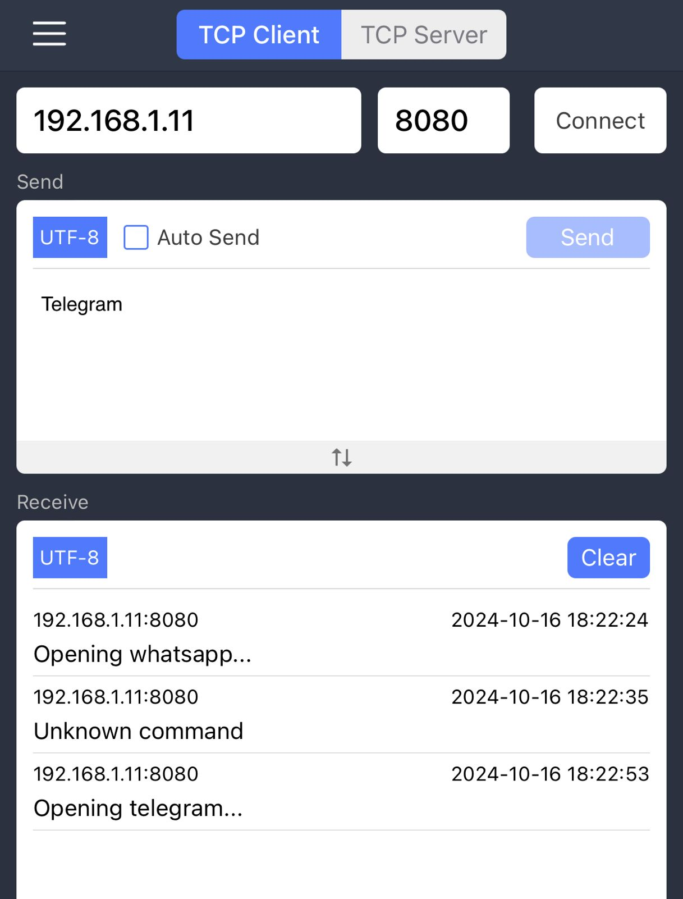
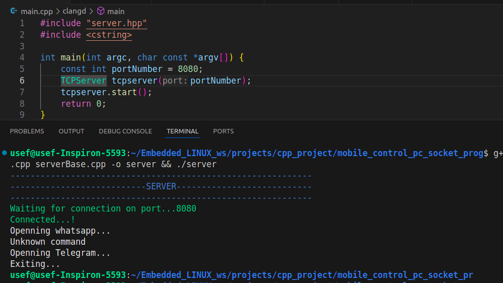
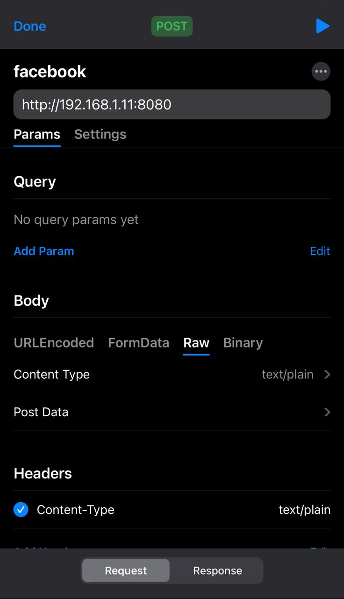
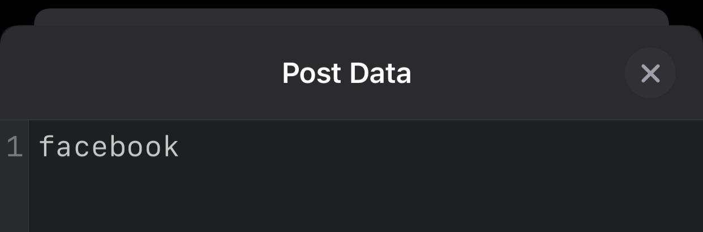
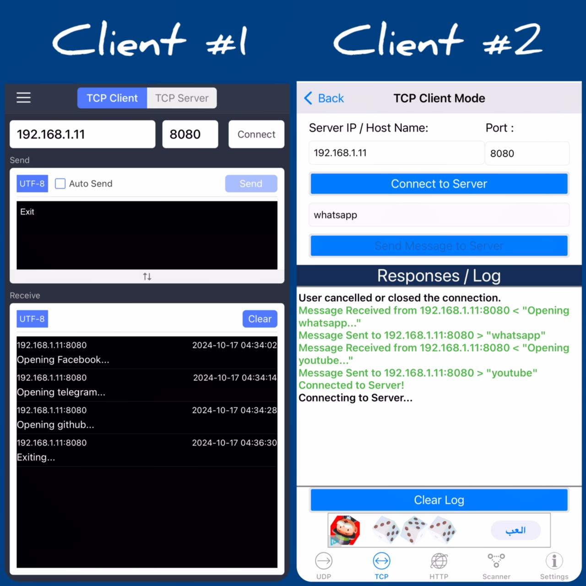
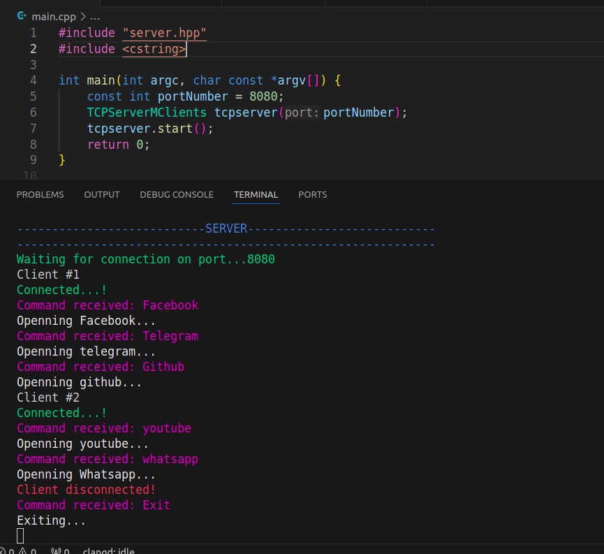

<!DOCTYPE html>
<html lang="en">
<head>
    <meta charset="UTF-8">
    <meta name="viewport" content="width=device-width, initial-scale=1.0">
</head>
<body>

<h1>Mobile Controls PC using Sockets</h1>

This project allows a <strong>mobile device to control a PC</strong> via <strong>socket programming in C++</strong>. Using a custom TCP/IP protocol and HTTP POST, the server listens for commands sent from the mobile device and executes corresponding actions, such as opening websites, launching applications, or performing basic operations like calculations.

<h2>Features</h2>
<ul>
    <li><strong>TCP/IP and HTTP POST Support</strong>: Communicate via custom or HTTP POST protocols.</li>
    <li><strong>Multi-client handling</strong>: Supports multiple connections using the <code>select()</code> function.</li>
    <li><strong>Command Processing</strong>:
        <ul>
            <li>Open Facebook, YouTube, WhatsApp, LinkedIn, and more.</li>
            <li>Launch VS Code, Calculator, etc.</li>
        </ul>
    </li>
    <li><strong>Keep-alive connection</strong>: The server maintains a persistent connection with the client.</li>
</ul>
<h2>How It Works</h2>
<h3>1. Server Side</h3>
<ul>
    <li>A socket is created to listen for incoming connections.</li>
    <li>Upon receiving a command, it is parsed and executed.</li>
    <li>A response is sent back to the mobile client.</li>
</ul>
<h3>2. Client Side</h3>
<ul>
    <li>The mobile app sends TCP/HTTP POST requests to the server with commands.</li>
    <li>The server processes these requests and performs the associated actions on the PC.</li>
</ul>
<h2>Setup Instructions</h2>
<ol>
    <li>Clone the repository:
        <pre><code>
git clone https://github.com/UsefElbedwehy/Embedded_LINUX.git </code></pre>
    </li>
    <li>Navigate to the project directory: 
    <pre><code>cd mobile-control-pc</code></pre>
    </li>
    <li>Compile the source files: <pre><code>g++ main.cpp server.cpp serverBase.cpp commands.cpp terminal.cpp -o control_server</code></pre>
    </li>
    <li>Run the server: <pre><code>./control_server</code></pre>
    </li>
</ol>
<h2>How to use it</h2>
<h3>1. Server Side</h3>
<ul>
    <li>Set port number.</li>
    <li>Choose your target(there are 3 options).<ol>    
        <li>
        Srever/client TCP/IP network protocol  with custom transmision protocol.</li>
        <li>
        Srever/client TCP/IP network protocol  with HTTP POST transmision protocol.
        </li>
        <li>
        Srever/Multiclient TCP/IP network protocol with custom transmision protocol.
        </li>
    </ol>
    </li>
    <li>Run the server.</li>
    <li>Wait for coming connections.</li>
</ul>
<h3>2. Client Side</h3>

The client side is according to the 3 options:

<ol> 
<li>
Srever/client TCP/IP network protocol  with custom transmision protocol.
</li>
    <ul>   
        <li>
        Open <strong>Network Kit</strong> apllication.
        </li>
        <li> 
        Choose <strong>TCP</strong> client.
        </li>
        <li>
        Connect to the <strong>ip address</strong> of the pc and the configured <strong>port number</strong>.</li>
        <li>
        Write the commands. i.e: facebook, github or exit.
        </li>
    </ul>
<h4>Mobile view(client):</h4>

<h4>PC view(server):</h4>

<li>
Srever/client TCP/IP network protocol  with HTTP POST transmision protocol.
</li>
    <ul>    
        <li>
        Open <strong>API Tester</strong> apllication.
        </li>
        <li> 
        Choose <strong>POST</strong> request.
        </li>
        <li>
        Connect to the <strong>ip address</strong> of the pc and the configured <strong>port number</strong>.</li>
        <li>
        Write the commands in <strong>Raw</strong>. i.e: facebook, github or exit.
        </li>
        <li>
        Choose text/plain.
        </li>
        <li>
        Send the request.
        </li>
    </ul>
    <h4>Mobile view:</h4>
    <h5>Setting IP and port, and making Content-Type: as text/plain (these setting are important to be sent in the hhtp POST request frame):</h5>

<h5>Here we write any command to be sent to pc .i.e facebook:</h5>

<li>
Srever/Multiclient TCP/IP network protocl with custom transmision protocol.
</li>
    <ul>    
        <li>
        Do the same like the first one put multiple times as it is for multiclient.</li>
    </ul>
    <h4>Mobile view:</h4>
    
    <h4>PC view(server):</h4>
    
</ol>
</body>
</html>
